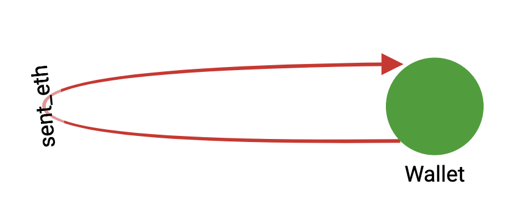
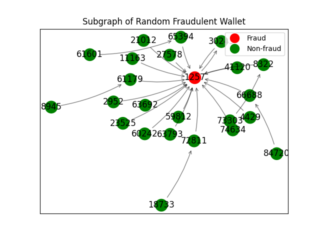
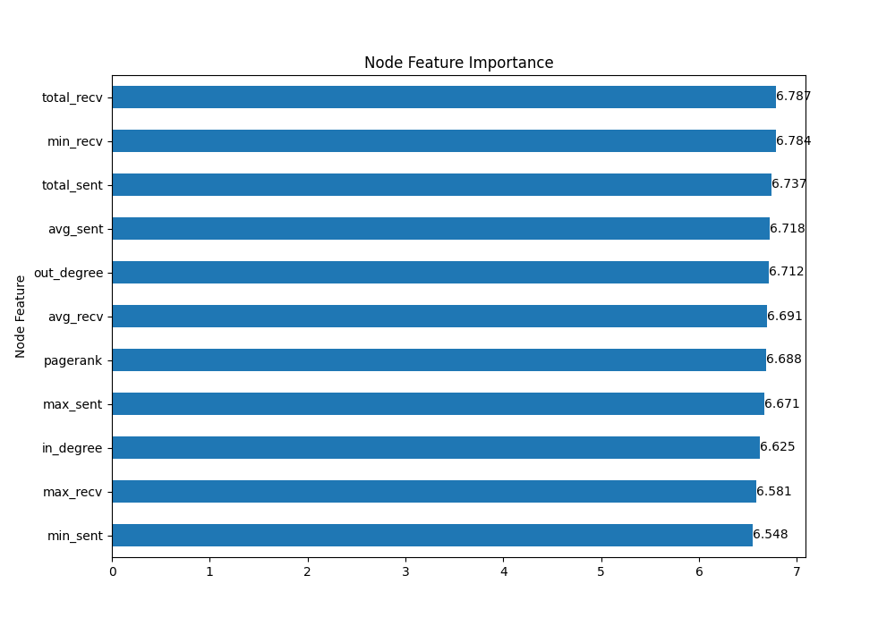

<em>Transaction Graph Schema</em>

# Motivation

According to the FTC, cryptocurrency scams have cost online users over $1 Billion since 2021. It is crucial to invest more resources into fraud detection for public confidence in blockchain and cryptocurrency adoption. As the popularity of Ethereum and other cryptocurrencies continues to grow, so does the potential for fraudulent activities within the transaction network. These activities can have a significant impact on both individual investors and the broader financial system. 

Additionally, the anonymous, decentralized nature of cryptocurriences makes it more challenging to identify and prevent fraudulent transactions. This highlights the need for more sophisticated and innovative fraud detection techniques. Finally, by investing in fraud detection, we can create a safer and more reliable environment for investors, which could increase overall confidence in the cryptocurrency market. Ultimately, investing in Ethereum fraud detection is a necessary step towards ensuring the integrity and sustainability of the cryptocurrency ecosystem.

This project aims to compare graph-based to non-graph based algorithms for fraud detection in Ethereum transaction networks. We will represent transactions within the blockchain as a graph of connected Ethereum wallets, and model the fraud detection task as a node classification problem. We will predict whether a given Ethereum wallet in the transaction graph is fraudulent or non-fraudulent, given the wallet's transaction history in the network. Graph storage, exploration, analysis, and model building will be conducted using [TigerGraph](https://tgcloud.io/), an enterprise-scale graph data platform for advanced analytics and machine learning.

# Why Graph?

Networks are a type of graph-structured data which is often used to describe the relationship between objects. Recently, there's been an explosive growth in utilizing network data to model interactions and represent data in social networks, biological systems, supply chain networks, and financial transactions.

Network embedding is a technique that represents graph nodes in a network as dense and low-dimensional vectors, while preserving their structural information and relationships. The goal is to capture the latent features and patterns of the network, which can be used for various downstream tasks such as node classification, link prediction, and clustering. The process involves training a machine learning model on the network data and generating embeddings that minimize the difference between predicted and observed edges or node attributes. Network embeddings have various applications and can help uncover hidden patterns and insights in the network data.

Modeling fraud detection in Ethereum transaction networks as a graph machine learning task can be achieved with [TigerGraph](https://tgcloud.io/) NoSQL graph databases. TigerGraph allows us to store our Ethereum transaction network as a graph with defined schemas for nodes (wallets) and edges (transactions). Additionally TigerGraph's proprietary graph query language, GSQL, enables computation of graph analytics with scalable queries. In our project, we utilized TigerGraph as a database to store our transaction network as a graph, conducted exploratory data analysis using GSQL queries, and engineered nodes with additional graph features by calculating summary statistics of transaction amounts (maximum, minimum, sum, average), indegree and outdegree, and pagerank.

# Data

The dataset contains transaction records of 445 phishing accounts and 445 non-phishing accounts of Ethereum. We obtain 445 phishing accounts labeled by [Etherscan](etherscan.io) and the same number of randomly selected unlabeled accounts as our objective nodes. The dataset can be used to conduct node classification of financial transaction networks. 

We collect the transaction records based on an assumption that for a typical money transfer flow centered on a phishing node, the previous node of the phishing node may be a victim, and the next one to three nodes may be the bridge nodes with money laundering behaviors, as figure shows. Therefore, we collect subgraphs by [K-order sampling](https://ieeexplore.ieee.org/document/8964468) with K-in = 1, K-out = 3 for each of the 890 objective nodes and then splice them into a large-scale network with 86,623 nodes and 106,083 edges.

The dataset can be downloaded from [XBlock](http://xblock.pro/#/dataset/6), one of the largest blockchain data platforms that collects current mainstream blockchain data and has the widest coverage in the academic community.

<em>Schematic Illustration of a Directed K-Order Subgraph for Node Classification.</em>

# Processing

We define fraud detection in Ethereum transaction networks as a node classification problem. We will represent the transaction network as a graph where nodes represent wallets/accounts and edges represent transactions between accounts. Each node in the network has the following features: id, indegree, outdegree, minimum sent, minimum sent, total sent, average sent, minimum received, maximum received, total received, average received, pagerank and label. Each edge in the network has one associated feature, the transaction timestamp. The labelled transaction data were split into 80% training and 20% testing sets. Our goal is to learn a function mapping node attributes to a label associated with account identity, whether the target account is fraudulent or not.

# Methods

## SVM

Our group started off with a support vector machine model (SVM) to act as our first non-graph model. This is a supervised machine learning algorithm with the objective to find the most optimal hyperplane that can best separate data points of different classes in an N-dimensional space (N being the # of features). Each transaction is represented as a vector, with each feature of the transaction (sent_eth, received_eth, pagerank) as a dimension in space. It then identifies the features that are most important for separating fraudulent and non-fraudulent transactions and finds the hyperplane that best separates the two classes. Because this is a supervised learning approach, we filtered out the unlabelled data and achieved an accuracy of 60.5% with this classification model. 

## KNN

Our second non-graph approach is a K-Nearest Neighbors model, where the features of each transaction are utilized to create a feature vector. The distance is then calculated between each feature vector of the test set and the existing feature vectors of the training set. The nearest transactions based on the smallest distances are identified and its label (fraudulent or non-fraudulent) is determined by its neighbors. For this algorithm, we achieved an average accuracy of 74.6%, which is higher than our first baseline using SVM. 

## XGBoost

For our last non-graph approach, we decided to use XGBoost (Extreme Gradient Boosting), which is an ensemble method that combines weak decision trees to create a stronger predictive model (boosting technique). This algorithm works by iteratively building decision trees and adjusting the weights of the transaction edges to minimize loss. XGBoost obtained an average accuracy of 81.6%, which is higher than some of the traditional and graph models we implemented. 

## Node2vec

Node2vec as an algorithm solves the problem of transforming the information inherent within a network into a workable numeric representation by transforming each node into a vector. The first step in this process is done through a random walk algorithm. In our case, the edges between the nodes are given weights corresponding to the transaction amount between accounts. These weights are used to simulate random paths between nodes from the network. In the next step, the skip-gram model works with these paths to learn and creates a node embedding for each node. How this is done is that it reads the random paths taken, and learns which nodes are likely to precede another node. These embeddings then allow us to determine the makings of a fraudulent account. We achieved the best results through the pytorch implementation, with roughly a 76.6% accuracy on the test set. The pytorch package allows us to make use of the large amount of unsupervised nodes present in our dataset, improving performance.
		
## GraphSage

GraphSage is most known for its inductive nature which allows it to better adapt to previously unseen nodes. In a setting like Ethereum transaction networks where the network evolves with new nodes and edges every day, there would be a benefit to using a model that does not have to be retrained every time new information is introduced. Additionally, in comparison to methods like node2vec, GraphSage has the advantage of being able to learn from node features. GraphSage works by starting at a node and aggregating information on its neighbors to generate the embeddings. The pytorch package for this model produced an accuracy of 81.9%, a noticeable upgrade compared to node2vec. This difference can be attributed to the fact that in a largely unsupervised dataset, an inductive approach may outperform the deductive approach.

## GCN

We worked with GCNs in our first quarter on our Clickbait Detection algorithm with TextGCN and we have implemented a version for this task as well. Much of the structure is the same; we create an adjacency matrix based on the edges of the network then propagate steps forwards (3 in our case) then form node embeddings based on these. From there, we can iterate through the nodes and update the node features by hashing the features of each neighboring node. The GCN model from pytorch produced an accuracy of 79.6%
	
## Graph Attention Network

We also tested the performance of Graph Attention Networks (GAT). GATs are a type of graph neural network that leverages masked self-attention which addresses the shortcomings of prior methods based on graph convolutions or their approximations. With GATs, we are able to extract meaningful node features by implicitly specifying different weights got different nodes in a neighborhood, without requiring costly matrix operations nor knowing the underlying graph structure upfront. GAT outperformed GCN and GraphSAGE on node classification tasks on the Cora dataset, so we hypothesized that this model may have similar performance on our dataset compared to other models. The GAT model from pytorch produced an accuracy of ∼78.5%, and slightly underperformed compared to GCN and GraphSAGE.

## Topology Adaptive - GCN

The final model we evaluated was Topology Adaptive GCN (TA-GCN). TA-GCN is a graph neural network defined in the vertex domain and outperforms many spectral graph convolutional neural networks (CNNs). TA-GCN utilizes a set of fixed-size learnable filters to perform convolutions on graphs. The topologies of these filters are adaptive to the graph’s topology when scanned for convolutions. TA-GCN inherits the properties of convolutions in CNNs for grid structured data, yet doesn’t require approximation to compute the convolution, leading to greater performance relative to spectral CNNs. TA-GCN is also computationally simpler than other graph neural networks. Additionally TA-GCN tends to achieve comparable or better accuracy than GCN and GraphSAGE for datasets with larger and sparser graph structures. We hypothesized that the sparsity of our transaction network will be beneficial for TA-GCNs performance in our node classification prediction task. We implemented a TA-GCN model using pytorch, which produced an accuracy of ∼82.2%, outperforming all of our models for comparison.

# Results

In this study, we conducted a comparative model performance evaluation experiment using graph and non-graph models to detect phishing fraud accounts against an Ethereum transaction network. Graph-based features improves overall model performance for both graph-based and non-graph-based models. Graph neural networks, specifically TA-GCN, performed best in the fraud detection task, as GNNs are able to learn the networks’ structural information. 

<em>Transaction Subgraph of Fraudulent Wallet</em>

Model performance was determined by taking the average classification accuracy on the testing set over 10 model runs. The resulting classifier performance for this prediction task are as follows:

* Support Vector Machine (~60.5%)
* K-Nearest Neighbors (~74.6%)
* XGBoost (~81.6%)
* Graph Convolutional Network (~79.6%)
* Graph Attention Network (~78.5%)
* GraphSAGE (~81.9%)
* Node2Vec (~76.6%)
* Topology Adaptive Graph Convolutional Network (~82.2%)

<em>TAGCN Node Feature Importance</em>

The most important features for predicting fraudulent wallets are pagerank and the maximum amount of ETH sent between wallets.

# Discussion
From our results, we found that the effectiveness of these algorithms depend on the models being used. For instance, we formed a hypothesis on why TA-GCN performed the best. The graph convolution of TA-GCN is characterized by multiplying polynomials of the graph adjacency matrix without any involved approximations, while traditional GCN models are based on approximating the convolution. Our performance improvements stem from the fact that we accurately capture the underlying graph structure without approximations during the convolution operation. In addition, filter topology is adaptive to the topology of the graph when scanning the graph to perform convolution, which allows for a better understanding and learning of the graph structure. This is in contrast to traditional GCN, which relies on fixed filters. Lastly, TA-GCN is computationally simpler and exhibits better performance when dealing with less sparse graphs. Given that our transaction network is not particularly sparse, this suggests that TA-GCN is well-suited for our network and may perform particularly well. 

In addition, our hypothesis regarding why XGBoost performed better than some GNNs is based on several factors. Firstly, XGBoost has the ability to learn from unlabelled data, taking advantage of all the training data similar to the GNN models we chose, thus improving predictive power. Additionally, XGBoost includes an early stopping feature that can help lessen the risk of overfitting, by stopping the training process once the model’s performance begins to worsen. However, XGBoost tends to perform worse when dealing with sparse data and imbalanced data. Fortunately, our transaction network is not sparse and our training set is not imbalanced, which means that XGBoost is not at a disadvantage in these regards. 

Lastly, GNN models performed better than traditional models due to their ability to utilize the full training set of unlabelled data. KNN and SVM, for example, require all labeled data or nodes for training, which can limit their effectiveness. GNNs, on the other hand, are able to leverage both labeled and unlabeled data, improving their ability to learn from the full training set.

From our experiment, we found that graph networks are a more powerful tool for modeling complex relationships in comparison to traditional non-graph models. Evaluating and improving machine learning models can have a significant impact on the accuracy and efficiency of fraud detection. Better models can detect more subtle patterns of fraudulent activity or reduce false positive rates, where real transactions are incorrectly flagged as fraudulent. Improving these graph models can offer advantages such as minimizing financial losses for people using Ethereum and developing trust in the Ethereum ecosystem. Furthermore, since Ethereum is a constantly growing platform, it’s essential to constantly evaluate and update machine learning models to prevent new types of fraud and adapt to changes in blockchain, ensuring the security and integrity of Ethereum. For future work, we may explore other types of algorithms that require different data structures and perhaps combine existing models to develop a model for specific tasks in blockchain. 

# References

[1] Alin Deutsch, Yu Xu, Mingxi Wu, Victor Lee: “TigerGraph: A Native MPP Graph Database”, 2019; [arXiv:1901.08248](http://arxiv.org/abs/1901.08248)

[2] Jiajing Wu, Qi Yuan, Dan Lin, Wei You, Weili Chen, Chuan Chen, Zibin Zheng: “Who Are the Phishers? Phishing Scam Detection on Ethereum via Network Embedding”, 2019, TSMC.2020.3016821; [arXiv:1911.09259](http://arxiv.org/abs/1911.09259)

[3] Jiajing Wu, Dan Lin, Zibin Zheng, Qi Yuan: “T-EDGE: Temporal WEighted MultiDiGraph Embedding for Ethereum Transaction Network Analysis”, 2019, Front. Phys. 8:204 (2020); [arXiv:1905.08038](http://arxiv.org/abs/1905.08038)

[4] Panpan Li, Yunyi Xie, Xinyao Xu, Jiajun Zhou, Qi Xuan: “Phishing Fraud Detection on Ethereum using Graph Neural Network”, 2022; [arXiv:2204.08194](http://arxiv.org/abs/2204.08194)

[5] Jian Du, Shanghang Zhang, Guanhang Wu, Jose M. F. Moura, Soummya Kar: “Topology Adaptive Graph Convolutional Networks”, 2017; [arXiv:1710.10370](http://arxiv.org/abs/1710.10370)

[6] Mark Cheung, John Shi, Lavender Yao Jiang, Oren Wright, José M. F. Moura: “Pooling in Graph Convolutional Neural Networks”, 2020; [arXiv:2004.03519](http://arxiv.org/abs/2004.03519)

[7] Hiroki Kanezashi, Toyotaro Suzumura, Xin Liu, Takahiro Hirofuchi: “Ethereum Fraud Detection with Heterogeneous Graph Neural Networks”, 2022; [arXiv:2203.12363](https://arxiv.org/abs/2203.12363)
